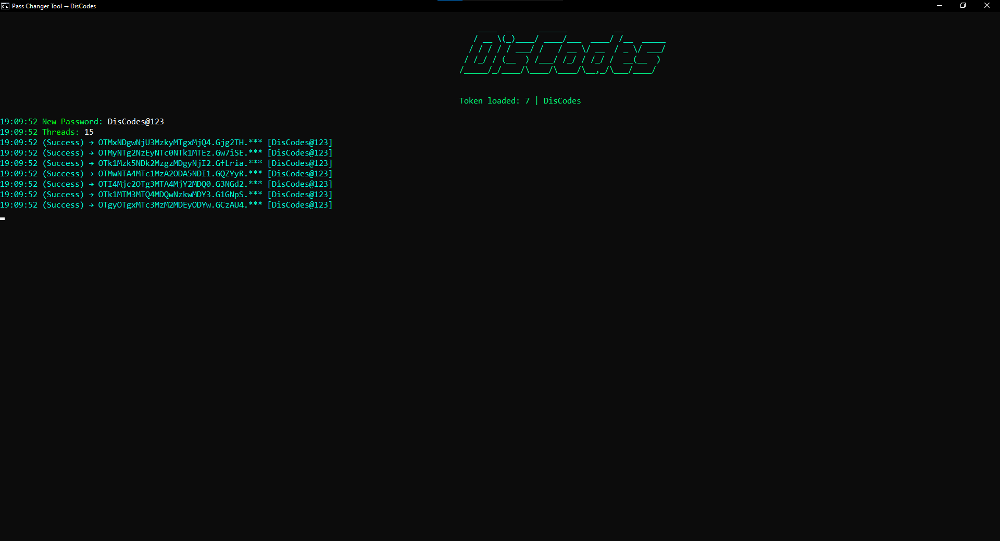

# **Discord Mass Token Password Changer**


## **Description**

This project provides a **token changer** that works **proxyless** but also supports proxies. The tool accepts tokens in the `email:pass:token` format and saves the updated tokens in `new_tokens.txt`. It's a simple, efficient solution to batch-process tokens, changing them as needed.

## **Table of Contents**

1. [Features](#features)
2. [Installation](#installation)
3. [Usage](#usage)
4. [Token Format](#token-format)

---

## **Features**
- Works **proxyless** by default.
- Optionally supports **proxies** if needed.
- Input and output tokens are stored in easy-to-manage text files.
- Processes tokens in the `email:pass:token` format.
- Saves updated tokens to a `new_tokens.txt` file.

## **Installation**

### Step 1: Clone the Repository
```bash
git clone https://github.com/your-username/token-changer.git
```

### Step 2: Navigate to the Project Directory
```bash
cd token-changer
```

### Step 3: Install Dependencies
```bash
pip install -r requirements.txt
```

### Step 4: Run the Token Changer
```bash
python main.py
```

---

## **Usage**

1. **Prepare `tokens.txt`:**  
   Ensure your tokens are stored in the following format inside the `tokens.txt` file:
   ```text
   email1:password1:token1
   email2:password2:token2
   ```

2. **Run the Script:**
   - If running **proxyless**:
     ```bash
     python main.py
     ```

   - If running **with proxies** (optional):
     Provide a proxy:
     ```bash
     python main.py
     ```

3. **Output:**
   Updated tokens will be saved in `new_tokens.txt` in the following format:
   ```text
   new_email1:new_pass1:new_token1
   new_email2:new_pass2:new_token2
   ```

---

## **Token Format**

The tokens in `tokens.txt` should follow this format:
```text
email:password:token
```
Each line represents one token combination.

---

## **ShowCase**

Here's a pic that shows how the code works

```markdown

```
